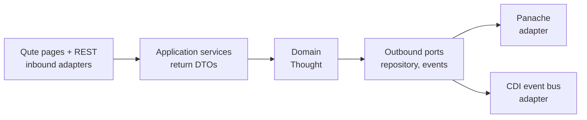
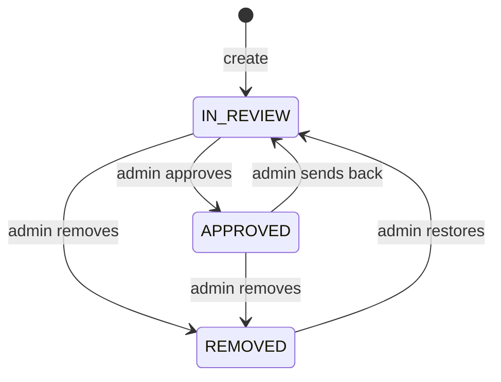

# Thoughtsapp Monolith — Feature Spec

Sep 24, 2026 · @Jeremy Davis

## Purpose and scope

Thoughtsapp-monolith is a single Quarkus application that re-implements the [Positive Thoughts](https://github.com/jeremyrdavis/thoughtsapp) microservices demo as a modular monolith, built entirely by the agentic team described in the [Meet the Agentic Team](https://claude.ai/code/artifact/c3c550ef-bbdb-4965-9bea-451f4f05a161) demo. The app exists to give the agents a real, bounded codebase with enforceable rules; it is a prop for the talk first and a product second.

The functional surface is a deliberately simplified subset of the original so the audience is judging the workflow, not the app: a public page that shows one random positive thought with thumbs-up/down voting, and an admin surface for CRUD and moderation. New thoughts wait in review until an admin approves them. The target repo is the empty [jeremyrdavis/thoughtsapp-monolith](https://github.com/jeremyrdavis/thoughtsapp-monolith).

What changes from the original: one Maven module instead of four services, in-process events instead of Kafka, server-rendered Qute pages instead of two Next.js apps, Hibernate ORM generating the schema, and no AI evaluation step. What stays: PostgreSQL, the 10–500 character content rule, the APPROVED / IN\_REVIEW / REMOVED status set, and the preloaded seed quotes from `quotes.json`.

Success for this spec means every feature below can be written as a GitHub issue with acceptance criteria a coding agent can satisfy without asking a human, and every architectural rule can be checked by a test the review agent can run.

## Architecture

The monolith is hexagonal (ports and adapters) with DDD tactical patterns inside, and every boundary rule is enforced by an ArchUnit test the agents must keep green. The abstract does not name an architecture; it commits to "enforcing architectural boundaries with automated tests" and "mutation testing to verify that tests actually detect defects," so hexagonal is chosen because its boundaries are the easiest to state as rules a machine can check.

Dependencies point inward only: adapters depend on application, application on domain, domain on nothing but the JDK. Inbound adapters call application services; application services return DTOs, never aggregates; outbound ports are interfaces owned by the domain or application layer and implemented in adapters.

| Layer | Package under `io.arrogantprogrammer.thoughts` | May depend on | Contains |
| --- | --- | --- | --- |
| Domain | `domain` | JDK only | `Thought` aggregate, value objects, `ThoughtStatus`, domain events, port interfaces |
| Application | `application` | domain | Use-case services, DTOs, transactional boundaries |
| Inbound adapters | `adapters.in.web`, `adapters.in.rest` | application | Qute resources, JAX-RS resources, request/response mapping |
| Outbound adapters | `adapters.out.persistence`, `adapters.out.events` | domain ports, application | Panache entities and mappers, CDI event publisher/observer |

The original's `com.redhat.demos` packages and the flat model/resource/service layout are not carried over; the Panache entity is an adapter detail, not the aggregate.

Stack: Quarkus 3.31.x on Java 25, PostgreSQL 17 (Quarkus Dev Services in dev and test), Hibernate ORM with Panache, Qute with htmx for interactivity, SmallRye Health and Micrometer. Build with Maven; generate the REST client contract from the OpenAPI document rather than hand-writing it.

Automated guardrails, all wired into `./mvnw verify` so CI and the review agent see the same result:

- ArchUnit tests in `src/test/java/.../architecture` asserting the dependency rules above, that no `adapters.*` type is referenced from `domain` or `application`, and that no application service method returns a domain type.
- PIT mutation testing on `domain` and `application` with a mutation-score threshold (start at 80%, raise per issue); adapters are excluded because their tests are integration tests.
- JaCoCo line coverage as a floor, not a target.
- `@QuarkusTest` integration tests for the persistence adapter, running against the Dev Services PostgreSQL instance.

Day to day, the app runs in Quarkus dev mode (`./mvnw quarkus:dev`), with Dev Services starting PostgreSQL automatically; there is no Docker Compose file. Tests use the same Dev Services database, and agents run the app the same way inside their sandboxes. Dev Services still needs a container runtime (Docker or Podman) to start PostgreSQL, but nothing has to be configured or started by hand.

A multi-stage Dockerfile packages the app as a container image. Dev Services does not run in the packaged app, so the container connects to a PostgreSQL 17 database supplied through the standard `QUARKUS_DATASOURCE_JDBC_URL`, `QUARKUS_DATASOURCE_USERNAME` and `QUARKUS_DATASOURCE_PASSWORD` environment variables. Nothing in the repo starts that database; whoever runs the container provides it.

## Domain model

One bounded context, `thoughts`, with a single aggregate root `Thought`.

| Concept | Kind | Fields / rules |
| --- | --- | --- |
| `Thought` | Aggregate root | `ThoughtId` (UUID), `Content` (10–500 chars, trimmed, non-blank), `Author` (name ≤ 200, bio ≤ 200, optional), `Rating`, `ThoughtStatus`, created/updated timestamps |
| `Rating` | Value object | `thumbsUp`, `thumbsDown` counters ≥ 0; `approvalRate()` = up / (up + down), 0 when no votes |
| `ThoughtStatus` | Enum | `IN_REVIEW` (new), `APPROVED`, `REMOVED`; only `APPROVED` thoughts are served to the public |
| `ThoughtCreated`, `ThoughtStatusChanged` | Domain events | Raised by the aggregate, published after commit by the events adapter |

Aggregate behaviour lives on `Thought`: `create(...)` validates and starts in `IN_REVIEW`; `thumbsUp()` and `thumbsDown()` mutate `Rating`; `approve()`, `remove()`, `restore()` and `sendBackToReview()` guard the allowed transitions.

Ports the domain and application layers declare: `ThoughtRepository` (save, findById, findRandomApproved, page, count) and `DomainEventPublisher`. Adapters implement them; nothing in `domain` or `application` imports Panache or CDI event types.

Schema, generated by Hibernate ORM from the Panache entity with `drop-and-create` in dev, test and the container: `thoughts` (id, content, author, author\_bio, thumbs\_up, thumbs\_down, status, created\_at, updated\_at). An `import.sql` script loads the 30+ quotes from the original `quotes.json` as `APPROVED` on every start, so data does not survive a restart.

## Features and issue backlog

Each row below becomes one GitHub issue in `thoughtsapp-monolith`, in the order shown, with the acceptance criteria copied verbatim into the issue body. Issues 0–2 are the skeleton Jeremy commits by hand before the demo; issues 3 onward are what the agents pick up. The acceptance criteria are written so a coding agent can decide it is done by running `./mvnw verify` and the listed checks, with no judgement call left to a human.

| # | Issue | Acceptance criteria |
| --- | --- | --- |
| 0 | Project skeleton | Quarkus app builds; packages for the four layers exist and are empty; `CLAUDE.md`, `AGENTS.md`, skills, ADR-001 (hexagonal monolith) and this spec are in the repo; `./mvnw quarkus:dev` starts the app with a Dev Services PostgreSQL and no extra setup |
| 1 | Architecture tests | ArchUnit suite asserts the layer rules and fails on a deliberate violation committed then reverted in the same PR; runs in `verify` |
| 2 | Mutation and coverage gates | PIT configured for `domain` and `application` with 80% threshold; JaCoCo report generated; both run in `verify` and in the GitHub Actions workflow |
| 3 | `Thought` aggregate and value objects | `Thought`, `Content`, `Author`, `Rating`, `ThoughtStatus` in `domain`; content and author rules enforced in constructors; status transitions per the state diagram; unit tests cover every rule and every illegal transition; PIT score ≥ 80% |
| 4 | Persistence adapter | Panache entity with Hibernate ORM schema generation; `import.sql` seeds the quotes from `quotes.json`; `ThoughtRepository` port implemented with Panache; entity-to-aggregate mapper; `@QuarkusTest` proves round-trip and `findRandomApproved` never returns non-approved rows |
| 5 | Random thought page | `GET /` renders one random `APPROVED` thought with author and bio in Qute; "another" button reloads via htmx; page shows a friendly empty state when no thoughts exist; REST Assured test asserts status 200 and content present |
| 6 | Voting | `POST /thoughts/{id}/thumbs-up` and `/thumbs-down` increment counters through the aggregate and re-render the card; votes on non-approved or missing thoughts return 404; concurrent votes do not lose updates (test with 20 parallel requests) |
| 7 | REST API | JSON endpoints matching the original: list (paged, default 20), get, create, update, delete, random, thumbs-up/down; OpenAPI document generated at `/q/openapi`; application services return DTOs (ArchUnit already checks this) |
| 8 | Admin list and create | `/admin/thoughts` table with content, rating %, status badge, pagination; create form with character counters and server-side validation errors rendered inline; protected by basic auth from `application.properties` |
| 9 | Admin edit, moderate, delete | Edit form with status transitions exposed as buttons (approve / remove / send back / restore) that call aggregate methods; delete asks for confirmation; illegal transitions return 409 with a message |
| 10 | In-process domain events | Aggregate records events; application service publishes them after commit via `DomainEventPublisher`; CDI adapter delivers `ThoughtCreated` and `ThoughtStatusChanged`; test observes events with an in-memory publisher |
| 11 | Health and metrics | Readiness check for the database; Micrometer counters for thoughts created, votes and status changes; `/q/health/ready` reports UP with the datasource check listed |
| 12 | Dev-mode runbook | Dev Services PostgreSQL image pinned to version 17 in `application.properties`; no datasource URL or credentials are configured by hand; README documents running the app with `./mvnw quarkus:dev` and the prerequisites (JDK 25 and a container runtime) |
| 13 | Dockerfile | Multi-stage `Dockerfile` builds the app with the Maven wrapper and runs the Quarkus fast-jar on a JDK 25 runtime image, exposing port 8080; the datasource comes only from the `QUARKUS_DATASOURCE_*` environment variables, with no credentials baked into the image; the GitHub Actions workflow runs `docker build`; README documents the `docker build` and `docker run` commands, including the environment variables |

Issues 3–7 are the demo's live set; they are small enough for one Claude Code run each and touch every layer at least once, so the review agent has boundary violations to look for. Issues 8–13 exist so the repo tells a complete story afterward and so an ambitious demo can pull a second batch.

## Non-goals, definition of done, open questions

Non-goals: AI evaluation of thoughts (embeddings, pgvector, Langchain4j, Ollama), Kafka or any external broker, a separate evaluation service, Next.js or any SPA frontend, OpenShift manifests, Red Hat Developer Hub registration, workshop materials, user accounts beyond basic auth for admin, and native-image builds. Each of these was in the original and each would cost demo time without adding anything the talk needs. Flyway migrations, Testcontainers-managed test infrastructure, Docker Compose, and deployment manifests for the container image are also out of scope.

Definition of done for any issue, enforced by the review agent and by CI on every PR:

- `./mvnw verify` passes: unit, integration, ArchUnit, PIT threshold, JaCoCo report.
- No new type in `domain` or `application` imports from `adapters`, Panache or Jakarta REST.
- Every acceptance criterion in the issue has at least one test that names it.
- The PR body links the issue, lists the tests added, and states the mutation score.

Open questions:

- [ ] Qute + htmx versus keeping a small React admin app: Qute keeps the monolith honest and the demo single-process, but drops the shadcn/ui look from the original. Decide before issue 0.
- [ ] PIT threshold of 80% is a guess; run PIT once on the skeleton's first real aggregate and set the number from that.
- [ ] The container reuses `drop-and-create` and the `import.sql` seed, so its data resets on every restart. Switch it to `update` without the seed if the data needs to survive restarts.
- [ ] `groupId` is `io.arrogantprogrammer` per your default, but the talk is under the Docker banner; confirm which identity the repo should carry.
